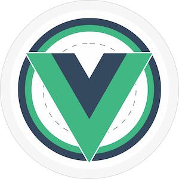

  
  <h1>Vue.js Bangalore // VueBLR</h1>
  
The <em>de-facto</em> Vue.js Community in Bengaluru, India

<DiscordBanner />

## Is this for me?

VueBLR is the *de-facto* Vue.js community in Bangalore, India. We host monthly meetups covering the ecosystem of Vue.js libraries and applications, as well as help the community come together via various social platforms. We intend to spread the awesomeness of Vue.js, how it empowers developers to build powerful, yet easy to maintain applications and how it inspires the community to come together to share and collaborate.

Here are a few reasons we think you should join VueBLR:

- You want to build powerful single-page applications but also not have to pull your hair out to maintain it
- Same as above but you want it to be server-rendered. Well, Vue can do that too!
- You are a backend engineer and want to pick a framework to learn without having to learn crazy new syntax. Vue.js is beloved by front-end and backend developers all around the world.
- You are considering options to pick a framework for your start-up/company. Join the community and we think you'll pick Vue.
- You're already working on Vue and want to connect with like-minded people, learn all-new stuff and stay on the bleeding edge. Well, what are you waiting for then?
- You think you know Vue well enough that you would like to share your ideas and thoughts with the community. Well, how about you [speak at our meetup?](https://bit.ly/vueblrcfp)

## Upcoming Meetups

<UpcomingEvents />

## Past Meetups

<PastEvents :limit="5" />

[See all events](/events.md)

## Organizers

- Sangeeth Sudheer - [@sangeeth96](https://github.com/sangeeth96)
- Nimit Bhargava - [@nimitbhargava](https://github.com/nimitbhargava)
- Ruphaa Ganesh - [@ruphaa](https://github.com/ruphaa)
- (Former) Rahul Kadyan - [@znck0](https://github.com/znck)
- (Former) Swapnil Agarwal - [@swapagarwal](https://github.com/swapagarwal)
